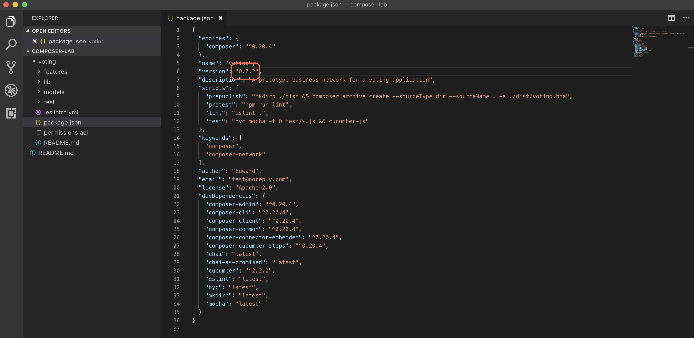
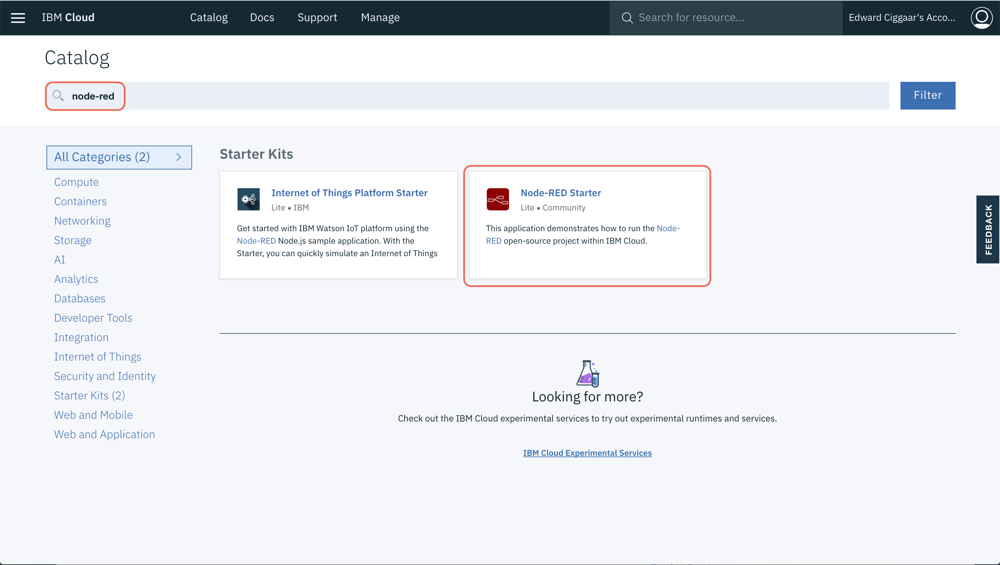

# Create a voting application prototype using Hyperledger Composer
To create a successful voting application, you need to ensure that the votes can never be changed or altered. A blockchain’s immutability provides this assurance. In this tutorial, you’ll use the Hyperledger Composer CLI together with the Hyperledger Composer Playground and some provided sample code to create, deploy locally, and experiment with a prototype for a secure and fair voting application.

The Hyperledger Composer Playground is the user interface contained in the open source Hyperledger Composer. The Playground is ideal for configuring, deploying, and testing a business blockchain network. Advanced features help you manage the security of your blockchain network, invite participants to your network, and connect to multiple networks.

The Hyperledger Composer CLI is a set of commands that can be used to perform multiple administrative, operational, and development tasks -- e.g. generating your business network archive file, deploy this BNA file to Hyperledger Fabric, generate a REST server, etc.

## Learning objectives
* Create the logic and permissions for a voting application on a blockchain network.
* Deploy your application locally.
* Test your application.
* Modify your existing business network and learn how to upgrade it.
* Expose your business network as RESTful endpoints.
* Build a Node-RED frontend that consumes the exposed RESTful endpoints.

## Step 1: Model the Voting Business Network 
Please follow the steps in the original tutorial that forms the basis of this lab. This tutorial will help you create the logic and basic permissions for a voting application on a blockchain network. When you finished the tutorial, please return to this page and continue with the next step.

Link to tutorial: https://developer.ibm.com/tutorials/cl-create-blockchain-voting-app-hyperledger-composer-playground/

## Step 2: Extend the Voting Business Network
The voting business network created in the Step 1 is a good starting point for the voting app. However, it is far from perfect. For example, the current voter participant has all rights in the business network. It can see the final results as well, while this is not strictly necessary. On the other hand, there is no observer role present in the current model. This could be added.

Exercise: Think how to extend the voting business network by adding a new participant (e.g. the observer). 

Note: the `voting` directory in the composer-lab contains the basic network that you built in [Step 1](#step-1-model-the-voting-business-network). Execute the commands below to clone this repository to your own environment.
```
cd <your preferred directory>
git clone https://github.com/eciggaar/composer-lab.git
```

### First Deployment of the business network
The business network that you created in the playground needs to be deployed locally as well. For this, make sure that the local blockchain network is started and that the PeerAdmin business card is created. You can check the status of your blockchain network by executing,
```
docker ps
```
on the command line. This should return a minimum of 4 active containers -- one peer, one CA, one orderer and one couchdb container. 
```
CONTAINER ID        IMAGE                               COMMAND                  CREATED             STATUS              PORTS                                            NAMES
7635d469a3e2        hyperledger/fabric-peer:1.2.1       "peer node start"        21 seconds ago      Up 20 seconds       0.0.0.0:7051->7051/tcp, 0.0.0.0:7053->7053/tcp   peer0.org1.example.com
119cd36c6f87        hyperledger/fabric-ca:1.2.1         "sh -c 'fabric-ca-se…"   22 seconds ago      Up 21 seconds       0.0.0.0:7054->7054/tcp                           ca.org1.example.com
b4690fb308ac        hyperledger/fabric-couchdb:0.4.10   "tini -- /docker-ent…"   22 seconds ago      Up 21 seconds       4369/tcp, 9100/tcp, 0.0.0.0:5984->5984/tcp       couchdb
898e13bdb97d        hyperledger/fabric-orderer:1.2.1    "orderer"                22 seconds ago      Up 21 seconds       0.0.0.0:7050->7050/tcp                           orderer.example.com
```
The presence of the PeerAdmin card can be checked by executing,
```
composer card list
```
which should result in
```
The following Business Network Cards are available:

Connection Profile: hlfv1
┌─────────────────┬───────────┬──────────────────┐
│ Card Name       │ UserId    │ Business Network │
├─────────────────┼───────────┼──────────────────┤
│ PeerAdmin@hlfv1 │ PeerAdmin │                  │
└─────────────────┴───────────┴──────────────────┘


Issue composer card list --card <Card Name> to get details a specific card

Command succeeded
```
Next, install the business network locally by changing directory to the place where you cloned the git repo. Then,
```
cd composer-lab/voting
```
Now, run
```
npm install
``` 
to build the new version of the business network. Next, install the network by running
```
composer network install -c PeerAdmin@hlfv1 -a ./dist/voting.bna
```
The network is started by executing the following command
```
composer network start -c PeerAdmin@hlfv1 -n voting -V 0.0.1 -A admin -S adminpw -f admin-voting.card
```
This command might take a minute to complete. Once it successfully finishes, import the voting admin card to the local Composer wallet. This enables the admin on the voting business network. 
```
composer card import -f admin-voting.card
```
which results in
```
Successfully imported business network card
	Card file: admin-voting.card
	Card name: admin@voting

Command succeeded
```
Finally, to check whether everything has been successfully set up, ping the network using the admin card. The name of the business card can be found in the output of the `composer card import` command.
```
composer network ping -c admin@voting
```
The result should be similar to
```
The connection to the network was successfully tested: voting
	Business network version: 0.0.1
	Composer runtime version: 0.20.4
	participant: org.hyperledger.composer.system.NetworkAdmin#admin
	identity: org.hyperledger.composer.system.Identity#9d0ec43ad74c66e5a05e07bc44b4afa243fb5eeb4466195f5675e401072e6cba

Command succeeded
```
### Update the business network
The changes you've made can be deployed to the blockchain network. For this make sure, you've changed the version number in the package.json file and that the changes have been saved.



Change directory to the place where you cloned the git repo. Then,
```
cd composer-lab/voting
```
and run 
```
npm install
``` 
to build the new version of the business network. Now install the network.
```
composer network install -c PeerAdmin@hlfv1 -a ./dist/voting.bna
```
Once the new BNA file has been installed on the blockchain network, the upgrade can be started by running
```
composer network upgrade -c PeerAdmin@hlfv1 -n voting -V <version_number>
```
where `<version_number>` should match the version number listed in the output of the `composer network install` command and the version number in the `package.json` file.

### Additional requirements to the voting prototype
The voting business network has further room for improvement :smile:. 

For example, whenever a vote has been successfully committed to the ledger, a notification needs to sent so that a front-end application could update the live voting scores. Another one could be to give voters the option to register themselves. Below a list of requirements that can be implemented.

1. Add events to the business network that allows a notification to be sent whenever a voter successfully placed a vote.
2. A voter should be able to register himself. To keep things simple, start by implementing a new transaction that creates a new `voter` and that adds a new `ifVoted` asset to the ledger.
3. Voters should only be able to vote. Observers should only be able to see the voting scores. They should not be able to vote. To accomplish this, change the `permissions.acl` file to reflect these rules.

Use the section [Update the business network](#update-the-business-network) to deploy the new features to the blockchain network. Don't forget to change the version number.
> Note: the 'finish' folder in this project contains a solution for all additional requirements. This might be useful if you're stuck and need inspiration on how to continue.

## Step 3: Generate the REST server
Once you're satisfied with the voting business network, you can generate a REST server that creates RESTful endpoints to your business network. These endpoints can be consumed by the front-end application. To generate a REST server from a deployed business network, enter the following commmand:
```
composer-rest-server -c admin@voting -n never -w true
```
This will generate a basic REST server without using namespaces, but with event publication over WebSockets enabled. If you want to use the wizard to guide you, use the command without options. The REST server will be listening at port 3000.

## Step 4: Build a front-end application (e.g. using Node-RED)
Now that the REST server is up and running, the business service is ready to be consumed by a front-end application. The front-end application for the voting prototype is actually split in two. 

1. The first part should cover the registration process for voters and the application should allow them to vote.
2. The second part is for the observer and should present a live dashboard (e.g. a bar diagram) showing the live scores as new votes are placed.

The Hyperledger Composer generator for Yeoman does have an option built in to generate an Angular client. This is done via the command 'yo hyperledger-composer:angular'. The Angular client will leverage the running REST server. 

Another option of course is to build your own front-end using whatever technology you like most. In this lab, Node-RED is used as the tool to build the front-end. The following steps help you getting started.

1. Make sure that you have registered for IBM Cloud. If not, you can register at: https://ibm.biz/BdY6KJ
2. Login to [IBM Cloud](http://console.bluemix.net).
3. In the IBM Cloud catalog, search for Node-RED and select the 'Node-RED Starter' starter kit. Accept the defaults and click **Create** to deploy the application.



4. Once the Node-RED environment is up-and-running, visit the app URL and complete the wizard. It basically asks you to secure your Node-RED editing environment with a userid and password. 
5. You can now use e.g. the flows available in the URL below as inspiration to build your own dashboard.

Have fun and happy coding!!! :smiley: :smiley:
